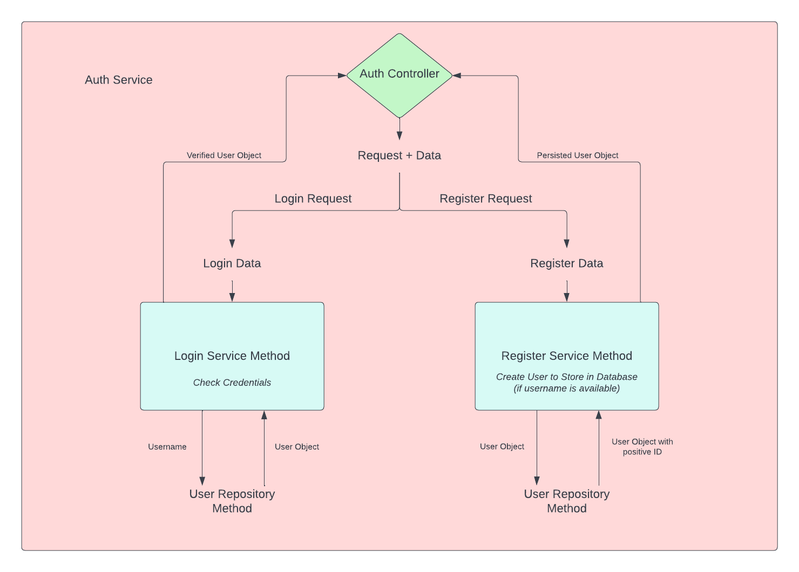
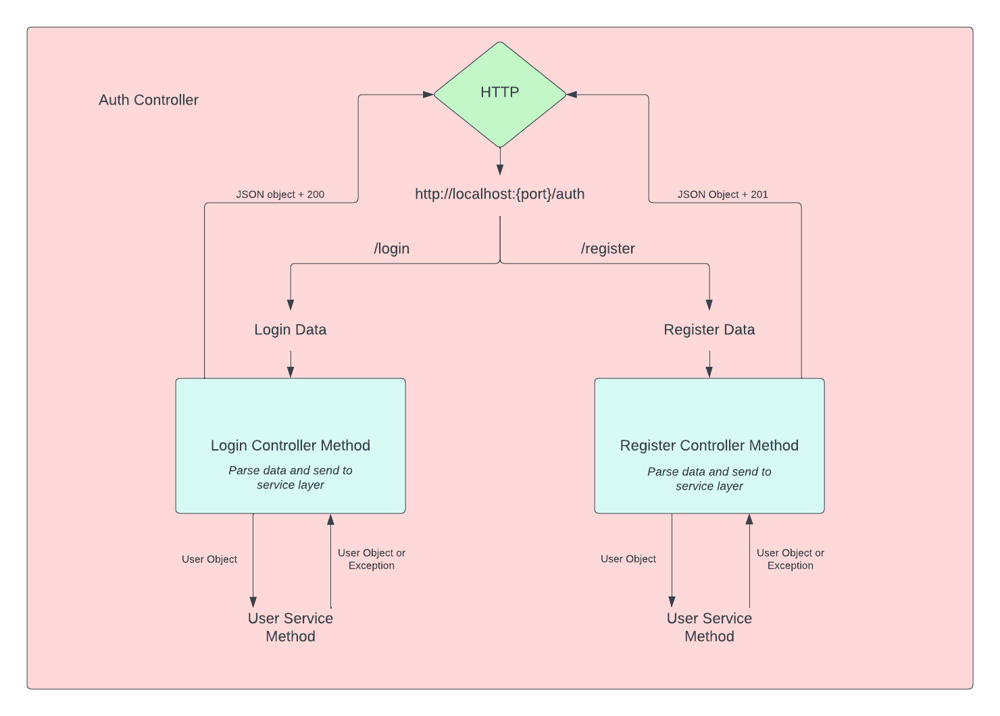
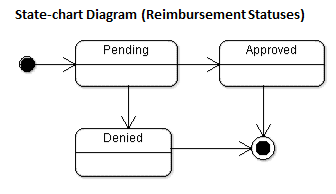

# About
This repository holds all information for the foundations project for the Revature LLC Training Program. This program utilizes Microsoft SQL Server as a database and uses a WebAPI for management purposes. The user can use a console front-end that strictly communicates to the API and uses asynchronous design principles. As a rule of thumb. There is no file in this program with more than 300 lines of code (which lead to a multitude of menu files in the console front-end).

# Project Description
This project is an Expense Management System with the purpose of managing Reimbursement requests from employees from a general company.
There are two possible types of users for this system; Employees and Managers. Each can do separate actions and see different scopes of information. All users can reset their password, login, and register from the home screen of the application


## Employee Permissions
    - An employee can create a reimbursement
    - An employee can view their tickets that they have made with the following constraints
        - All tickets from that employee
        - A specific ticket with the ticket number provided when creating a ticket
        - A group of tickets based on the status of the ticket

## Manager Permissions
    - A manager can approve or deny a reimbursement request
    - A manager can view tickets with the following constraints
        - All tickets in the database
        - All tickets from a particular employee
        - All tickets with a particular status
        - A specific ticket by the ticket number
    - A manager can also view users with the following constraints
        - All users in the database
        - A specific user by their user ID
        - A specific user by their username
    - A manger can finally change the payroll status and permissions of a user by changing them from an employee to manager or vice versa
    - Finally, a manager can fire/delete a user from the table

# Layers of the program
This project has 4 program layers to the total project. These layers are in the following order from the lowest layer to the user interface
    - Data Access
    - Services
    - WebAPI
    - Console Front-End

## Data Access Layer
This layer utilizes a mixture of singleton and factory design processes.  There are 4 classes in this layer:
    - ConnectionFactory
    - TicketRepository
    - UserRespository
    - DAO

### ConnectionFactory
This class has two methods; GetInstance and GetConnection. This class utilizes the package System.Data.SqlClient from the NuGet library to use the class SqlConnection.
#### GetInstance
    - Will generate a single instance of the connection string for the database.
    - This connection string is a private member of the class since no other class need access to the connection
#### GetConnection
    - Will generate a connection to the database from the connection string generated by the GetInstance method

### DAO
    - This set of interfaces contain the two interfaces for the TicketRepository and UserRepository
    - This will be the way the service layer commicates with the DataAccess layer.

#### ITicketDAO
This contains the methods for TicketRepository that the user should have access to:
    - GetAllTickets
    - GetTicketsByAuthor
    - GetTicketsById
    - GetTicketsByStatus
    - CreateTicket
    - UpdateTicket

#### IUserDAO
This contains all the methods for UserRepository that the user should have access to:
    - GetAllUsers
    - GetUserByUsername
    - GetUSerByUserId
    - ResetPassword
    - PayRollChange
    - CreateUser
    - DeleteUser

### TicketRepository
This class talks to the database specifically the table of tickets. This will provide all needed sql commands through the use of the package System.Data.SqlClient.

#### GetAllTickets
    - Operates the sql statement 
```sql 
SELECT * FROM P1.tickets;
```
    - Will return the entire table using a List<Tickets>
    - Will throw a custom exception `ResourceNotFoundException()` if the database is empty

#### GetTicketsByAuthor
    - Operates the sql statement
```sql
SELECT *FROM P1.tickets where author_fk = @a; -- @a indicates where the author's id would be
```
    - Will return a complete list of all tickets authored by a specific user
    - Will throw a custom exception `ResourceNotFoundException()` if the database is empty

#### GetTicketsById
    - Operates the sql statement
```sql
SELECT *FROM P1.tickets where ticketNum = @a; -- @a indicates where the tickets id would be
```
    - Will return a specific ticket
    - Will throw a custom exception `ResourceNotFoundException()` if that ticket hasn't been made yet
#### GetTicketsByStatus
    - Operates the sql statement
```sql
SELECT *FROM P1.tickets where status = @a; -- @a indicates where the status would be
```
    - Will return a complete list of all tickets with the specified status
    - Will throw a custom exception `ResourceNotFoundException()` if there are no tickets with that status
#### CreateTicket
    - Operates the sql statement
```sql
insert into P1.tickets(author, description, amount) values(@ai, @d, @a);
/*
    @ai = specific user ID from the author
    @d = reason for the ticket
    @a = monetary value of the ticket
*/
```
    - Will return true if the ticket was created
    - Will throw a custom exception `ResourceNotFoundException()` if the ticket could not be generated
#### UpdateTicket
    - Operates the sql statement
```sql
update P1.tickets set status =@s,resolver = @r where ticketNum =@t;
/*
    @s = new status for the ticket
    @r = the specific user ID for the resolver
    @t = the ticket number to update
*/
```
    - Will return true if the ticket was updated
    - Will throw a custom exception `ResourceNotFoundException()` if the ticket could not be updated
    - Will throw a custom exception `UsernameNotAvailable()` if there is no ticket with that ticket number

### UserRepository
This class talks to the database specifically the table of users. This will provide all needed sql commands through the use of the package System.Data.SqlClient.

#### GetAllUsers
    - Operates the sql statement 
```sql 
SELECT * FROM P1.users;
```
    - Will return the entire table using a List<Users>
    - Will throw a custom exception `ResourceNotFoundException()` if the database is empty

#### GetUserByUsername
    - Operates the sql statement 
```sql 
SELECT * FROM P1.users where username = @u;--@u is the specific username
```
    - Will return the specific user
    - Will throw a custom exception `ResourceNotFoundException()` if the username is not in the database
    - Will throw a custom exception `UsernameNotAvailable()` if the username is not valid

#### GetUSerByUserId
    - Operates the sql statement 
```sql 
SELECT * FROM P1.users where userID = @i;--@i is the specific userID
```
    - Will return the specific user
    - Will throw a custom exception `ResourceNotFoundException()` if the userId does not exist in the table

#### ResetPassword
    - Allows any user to reset their password so long as they know their id
    - Operates the sql statement
```sql
update P1.users set password = @p where userID = @i;
/* 
    @p = specific password
    @i = userID
*/
``` 
    - Will throw a custom exception `ResourceNotFoundException()` if the user doesn't exist

#### PayRollChange
    - Allows managers to change the role of any user
    - Operates the sql statement
```sql
update P1.users set role = @r where userID = @i;
/* 
    @r = new role
    @i = userID
*/
``` 
    - Will throw a custom exception `ResourceNotFoundException()` if the user doesn't exist

#### CreateUser
    - Operates the sql statement
```sql
insert into P1.users(username,password, role) values (@u, @p,@r);
/*
    @u = specific username
    @p = specific password
    @r = users role
*/
```
    - Will return the new user
    - Will throw a custom exception `UsernameNotAvailable()` if the user could not be created

#### DeleteUser
    - Allows a manager to remove a user
    - Operates the sql statement
```sql
delete from P1.users where userID = @i; -- @i = userID for the user you wish to remove
``` 
    - Will throw a custom exception `ResourceNotFoundException()` if the user couldn't be deleted

## Services
The services layer services as an intermediate layer from the user and api to the DataAccess layer. This is a crucial component to any program as there should be protected information and hidden methods from the user. Think about do you need to know all the workings of making a phone to use it?

This layer simply calls the specific methods needed to operate the endpoints and is seperated into 3 distinct classes.

### AuthService
    - This will handle requests like:
        - Login
        - Register
        - Password Resets



### UserService
    - This will handle requests like:
        - Getting all users
        - Getting a specific user by the user id
        - Getting a specific user by the username
        - Firing a user

### TicketService
    - This will handle requests like:
        - Getting all tickets
        - Getting all tickets from a specific author by the author's userID
        - Getting all tickets with a specific status
        - Getting a specific ticket with a specific ticket number
        - Creating a ticket
        - Updating a ticket

## WebAPI
The WebAPI layer uses a combination of Controllers and HTTP requests to implement the services layer in indivdual endpoints. These endpoint are listed on the [trello board](https://trello.com/b/qsPNwUwC/juniper-net-foundations-project) in the task ["Endpoint Mapping"](https://trello.com/c/ajG0REbd/754-endpoint-mapping).

The HTTP requests being used in this project are GET,POST,PUT,and DELETE. 
The Controllers closely match the service layer.
The WebAPI implements the Swashbuckle.AspNetCore package and implements the builder.Services collections:
    - AddSingleton: For the ConnectionFactory.GetInstance() method
    - AddScoped: For the DataAccess layer and the controllers
    - AddTransient: For the Services layer

### HTTP Requests
    - app.MapGet: implements the HTTP GET Request for obvious Get methods
    - app.MapPost: implements the HTTP POST Request for methods where an entry is created in a table
    - app.MapPut: implements the HTTP PUT Request for methods where an entry is being updated
    - app.MapDelete: implements the HTTP DELETE Request for methods where an entry is being removed from a table

### Controllers
The Controllers will act as a communication layer to the services layer in the project. There are three Controller following the same design as the Service Layer.

#### AuthController
This controller will implement the AuthService class in the API. All methods return either a 200 Status code or 400/401 Status code in this controller.



#### UserController
This controller will implement the UserService class in the API. All Methods return either a 202 Status code or a 400/404 Status code in this controller.

#### TicketController
This controller will implement the UserService class in the API. All Methods return either a 202 Status code or a 400/409 Status code in this controller.

## Console Front-End
Last, but certainly not least, this layer interacts directly with the user and the API only. In other words this is the application, its how the user will interact with the database and can view everything. There are a total of 6 menus in this section with different viewing parameters based on the role of the user.

I suppose now would be a good time to explain the Models I have been using up to this point. There is a model for Tickets and Users.

### Tickets Model
This model will serve as the template for any and all tickets to be gathered, created, updated, and viewed. Therefore this must be a public class with public get and set methods for public members.

The members of this class and their datatypes are:
```csharp
enum Status{Pending,Approved,Denied}
int ticketNum;
int author;
int resolver;
decimal amount;
string description;
Status state;
```

The status is made an enum for easy verification and defaults. The default for a ticket is Pending as a ticket cannot logically start approved or denied.



### Users Model
This model will serve as the template for any and all users to be gathered, created, updated, fired, and viewed. Therefore this must be a public class with public get and set methods for the public members.

The members of this class and their datatypes are:
```csharp
enum Role{Employee,Manager}
int userId;
string username; 
string password;
Role role;
```

The role is made an enum for easy verification and defaults. The default for a user is Employee.

### First Screen


